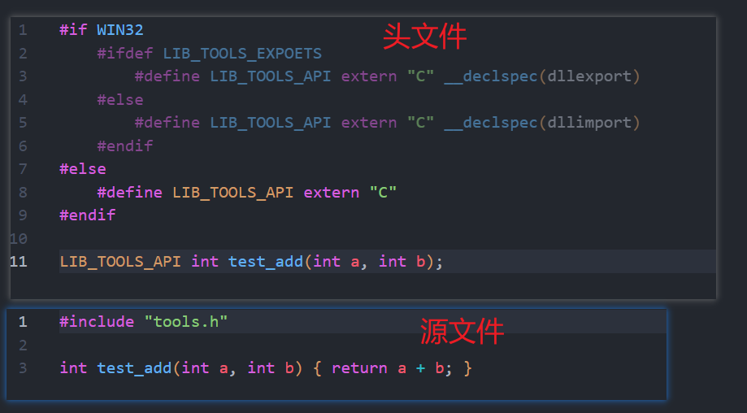

# cmake 生成、使用动态库和 linux 动态库路径(LD_LIBRARY_PATH)

## 1.cmake

```shell
tree /f
│  .clang-format
│  .gitignore
│  CMakeLists.txt
│  readme.md
│
├─cmake
│      enable_warning.cmake
│
├─example 使用 dll
│      CMakeLists.txt
│      use_tools.cpp
│
├─include
└─src 生成 dll
        CMakeLists.txt
        tools.cpp
        tools.h
```

### 1.外层 CMakeLists


### 2. 生成动态库




### 3. 使用动态库


## 2. 链接路径

### 2.1 windows

    同一目录即可

### 2.2 linux

```shell
mkdir build
cd build
cmake ..
make -j8
ldd use_tools
```


### 1. 设置全局动态库

```shell
sudo mv build/lib/libtools.so /usr/local/bin/
# 设置全局动态库路径
export LD_LIBRARY_PATH=/usr/local/bin:${LD_LIBRARY_PATH}

# 缺点：你的所有部署的启动的程序的动态库目录很多，而且可能重复，并且不是每一个程序都需要
```

### 2. 设置临时动态库路径 `推荐`

```shell
mv build/lib/libtools.so build/bin/
cd build/bin/

touch start.sh
chmod 777 start.sh
./start.sh
```

```shell
# !/bin/bash

crt_dir=$(pwd)
export LD_LIBRARY_PATH=$(pwd):${LD_LIBRARY_PATH}
./use_tools
```
